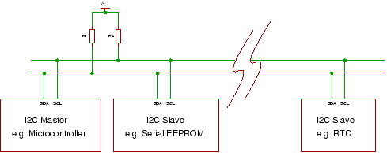
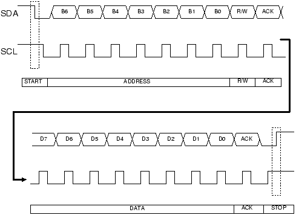
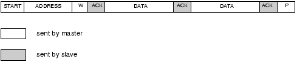
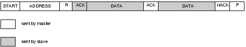

I2C Basics
==========

I²C (pronounced I-squared-C) created by Philips Semiconductors and commonly written as 'I2C' stands for Inter-Integrated Circuit and allows communication of data between I2C devices over two wires. It sends information serially using one line for data (SDA) and one for clock (SCL).

### Master and slave

The phillips I2C protocol defines the concept of master and slave devices. A master device is simply the device that is in charge of the bus at the present time and this device controls the clock and generates START and STOP signals. Slaves simply listen to the bus and act on controls and data that they are sent.

The master **can send data to a slave** or **receive data from a slave** - **slaves do not transfer data between themselves**.

### Multi Master

Multi master operation is a more complex use of I2C that lets you have **different controlling devices on the same bus**. You only need to use this mode if you have more than one microcontroller on the bus (and you want either of them to be the bus master).

Multi master operation involves **arbitration of the bus** (where a master has to fight to get control of the bus) and **clock synchronisation** (each may a use a different clock e.g. because of separate crystal clocks for each micro).

### Data and Clock
The I2C interface uses two bi-directional lines meaning that any device could drive either line. In a single master system the master device drives the clock most of the time - the master is in charge of the clock but **slaves can influence it to slow it down**.

The two wires must be driven as open collector/drain outputs and must be pulled high using one resistor each - this implements a 'wired AND function' - any device pulling the wire low causes all devices to see a low logic value - for high logic value all devices must stop driving the wire.

_You will often will find devices that you realise are I2C compatible but they are labelled as using a '2 wire interface'. The manufacturer is avoiding paying royalties by not using the words 'I2C'!_

### Speed
Standard clock speeds are 100kHz and 10kHz but the standard lets you use clock speeds from zero to 100kHz and a fast mode is also available (400kHz - Fast-mode). An even higher speed (3.4MHz - High-speed mode) for more demanding applications - The mid range PIC won't be up this mode yet!

Note that the low-speed mode has been omitted (10kHz) as the standard now specifies the basic system operating from 0 to 100kHz.

### Slow peripherals
A slow slave device may need to stop the bus while it gathers data or services an interrupt etc. It can do this while holding the clock line (SCL) low forcing the master into the wait state. The master must then wait until SCL is released before proceeding.

### Data transfer sequence

A basic Master to slave read or write sequence for I2C follows the following order:

I2C Tutorial : I2C basic command sequence

1. Send the START bit (S).
2. Send the slave address (ADDR).
3. Send the Read(R)-1 / Write(W)-0 bit.
4. Wait for/Send an acknowledge bit (A).
5. Send/Receive the data byte (8 bits) (DATA).
6. Expect/Send acknowledge bit (A).
7. Send the STOP bit (P).

The sequence 5 and 6 can be repeated so that a multibyte block can be read or written.

**Note:** _You can use 7 bit or 10 bit addresses._

####  Data Transfer from master to slave

A master device sends the sequence S ADDR W and then waits for an acknowledge bit (A) from the slave which the slave will only generate if its internal address matches the value sent by the master. If this happens then the master sends DATA and waits for acknowledge (A) from the slave. The master completes the byte transfer by generating a stop bit (P) (or repeated start).

#### Data transfer from slave to master

A similar process happens when a master reads from the slave but in this case, instead of W, R is sent. After the data is transmitted from the slave to the master the master sends the acknowledge (A). If instead the master does not want any more data it must send a not-acknowledge which indicates to the slave that it should release the bus. This lets the master send the STOP or repeated START signal.

### Device addresses
Each device you use on the I2C bus must have a unique address. For some devices e.g. serial memory you can set the lower address bits using input pins on the device others have a fixed internal address setting e.g. a real time clock DS1307. You can put several memory devices on the same IC bus by using a different address for each.

**Note**: _The maximum number of devices is limited by the number of available addresses and by the total bus capacitance (maximum 400pF)._

### General call

The general call address is a reserved address which when output by the bus master should address all devices which should respond with an acknowledge.Its value is **0000000** (7 bits) and written by the master 0000000W. If a device does not need data from the general call it does not need to respond to it.

TODO: Complemete the remaining doc

[Sources]

<http://www.best-microcontroller-projects.com/i2c-tutorial.html>

